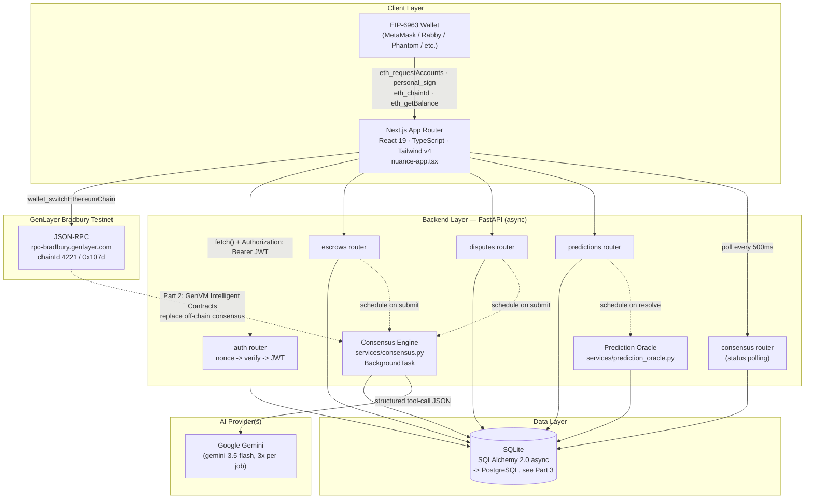
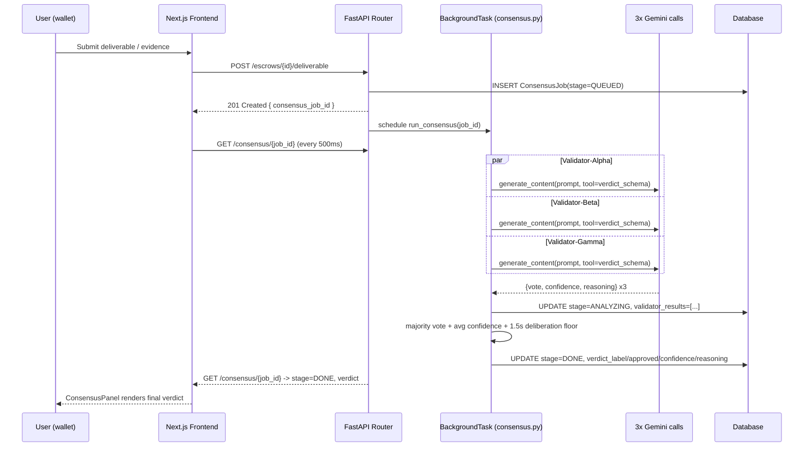
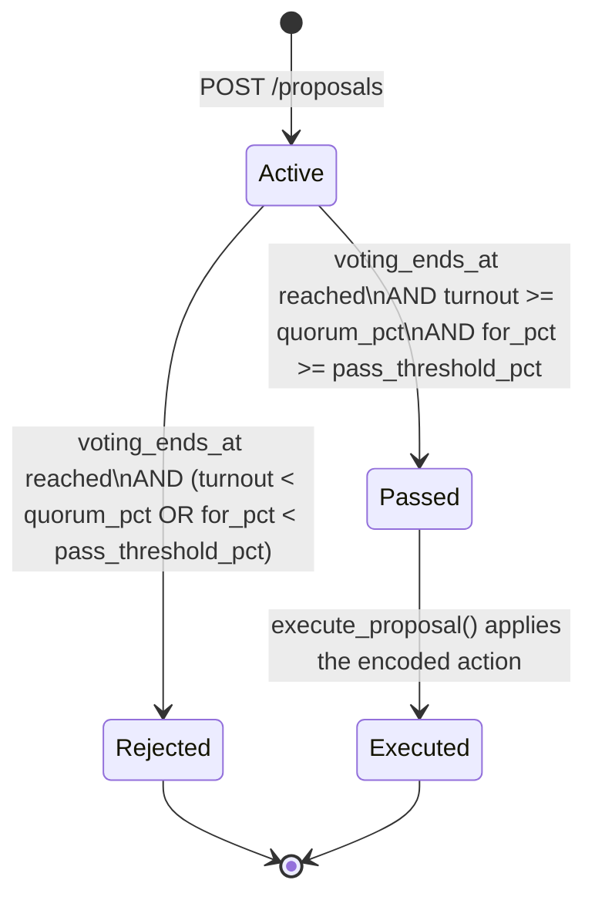
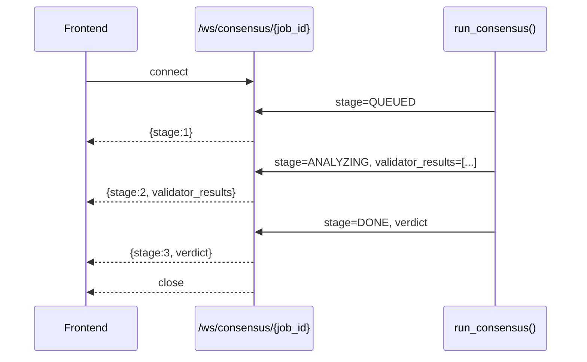
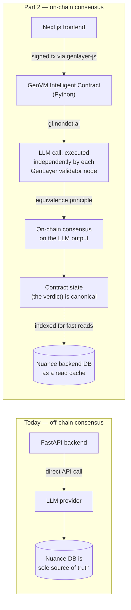

# 🧭 Nuance — Engineering Roadmap

> Contracts that understand nuance, not just logic.
> AI-validator consensus for claims traditional smart contracts can't settle — was the work actually good, did the campaign really mislead, who broke the deal.


---

## Table of Contents

1. [System Overview](#1-system-overview)
2. [Phase 0 — Current State & Baseline Audit](#2-phase-0--current-state--baseline-audit)
3. [Part 1 — Backend Completion & Full Feature Parity](#3-part-1--backend-completion--full-feature-parity-immediate-sprint)
4. [Part 2 — GenLayer On-Chain Transition (GenVM)](#4-part-2--genlayer-on-chain-transition--intelligent-contracts-genvm-integration)
5. [Part 3 — Production Hardening, Realtime UX & Security](#5-part-3--production-hardening-security-real-time-ux--analytics)
6. [Part 4 — Ecosystem Expansion & Mainnet Readiness](#6-part-4--ecosystem-expansion-autonomous-agents--mainnet-readiness)
7. [Appendix](#7-appendix)

---

## 1. System Overview

### 1.1 Mission

Nuance lets two parties commit to an agreement whose fulfillment is *subjective* — quality of work, truthfulness of a claim, fairness of a dispute — and settles it with a panel of independent AI validators reaching **consensus** instead of a human arbitrator or a rigid on-chain condition. It is built for **GenLayer's Testnet Bradbury**, the first blockchain purpose-built to let smart contracts (there, "Intelligent Contracts") reason in natural language via LLMs, with disagreement between validator nodes resolved by GenVM's **Optimistic Democracy** / equivalence-principle consensus.

### 1.2 Core Modules

| Module | What it does | Primary backend surface |
|---|---|---|
| **Intelligent Escrows** | Two-party milestone-based payments; a milestone releases only once AI validators agree the submitted deliverable meets its stated criteria. | `routers/escrows.py`, `services/consensus.py` |
| **Dispute Resolution Court** | Either party escalates a milestone/escrow disagreement; both sides submit evidence, an AI validator jury rules, a ruling gets enforced. | `routers/disputes.py`, `services/consensus.py` |
| **Prediction Markets** | Wallet-scoped YES/NO positions on real-world claims; an autonomous oracle resolves the market and computes payouts. | `routers/predictions.py`, `services/prediction_oracle.py` |
| **Autonomous Governance** | Plain-language proposals voted on by the wallet-holding community, executed automatically once passed. | *Not yet built — see [Part 1](#31-governance-engine)* |

### 1.3 Architecture — Today



> [!NOTE]
> Today's consensus engine is **off-chain, on-chain-flavored** by design (see `plan.md`): wallet connection and network identity are real, but the validator deliberation itself runs as a FastAPI background task calling Gemini directly, not as a GenVM Intelligent Contract. [Part 2](#4-part-2--genlayer-on-chain-transition--intelligent-contracts-genvm-integration) is the plan to close that gap.

### 1.4 Consensus Lifecycle — Today



---

## 2. Phase 0 — Current State & Baseline Audit

Everything in this section is **built and verified working today** (24/24 backend pytest tests pass; `npx tsc --noEmit` is clean).

### 2.1 What's Working

- [x] **Frontend core** — `nuance-app.tsx` app-shell with view routing (`dashboard`, `detail`, `create`, `predictions`, `predictionDetail`, `disputes`, `disputeDetail`, `governance`, `validators`, `agents`, `settings`); clean TS compilation.
- [x] **Web3 auth & session**
  - [x] EIP-6963 multi-wallet discovery (`use-wallet-detection.ts`, `wallet-catalog.tsx`) + legacy `window.ethereum` fallback.
  - [x] Real connection flow: `eth_requestAccounts` → `personal_sign` → `eth_chainId` → `eth_getBalance`, live `accountsChanged`/`chainChanged` subscriptions (`use-wallet-connection.ts`).
  - [x] GenLayer Bradbury network params sourced from the official `genlayer-js` SDK (`genlayer-chain.ts`) driving `wallet_switchEthereumChain` / `wallet_addEthereumChain`.
  - [x] Server-side SIWE-style auth: `POST /auth/nonce` → sign → `POST /auth/verify` (`eth_account.Account.recover_message`) → JWT, attached as `Authorization: Bearer` by `lib/api.ts`.
  - [x] Automatic 401 handling: `ApiError` + `setUnauthorizedHandler` drops the stored token and disconnects the wallet UI in lockstep.
- [x] **Backend foundation** — FastAPI (async), SQLAlchemy 2.0 async models, SQLite via `init_db()`, CORS, `/health`. 24/24 pytest passing (`test_auth_flow.py`, `test_consensus.py`, `test_predictions.py`).
- [x] **Escrows vertical** — `GET/POST /escrows`, `GET /escrows/{id}`, `POST /escrows/{id}/deliverable` (schedules a `ConsensusJob`), `POST /escrows/{id}/release`.
- [x] **Dispute Court vertical** — `GET/POST /disputes` (implicit via escrow), dispute messages (`GET/POST /disputes/{id}/messages`), evidence (`GET/POST /disputes/{id}/evidence`, schedules a `ConsensusJob`), `POST /disputes/{id}/enforce`.
- [x] **Prediction Markets vertical** — `GET /predictions`, `GET /predictions/{id}`, `POST /predictions/{id}/bet`, and an **autonomous resolution oracle** — `POST /predictions/{id}/resolve` (`services/prediction_oracle.py`) — this was flagged as an open gap in the original `plan.md` and has since shipped ahead of schedule.
- [x] **AI Consensus Engine** — `services/consensus.py`: 3 concurrent Gemini calls (`Validator-Alpha/Beta/Gamma`, matching `VALIDATOR_NAMES` in `consensus-panel.tsx` exactly), structured output via a Pydantic tool schema (`vote`/`confidence`/`reasoning`), `tenacity` retry with exponential backoff, majority-vote aggregation, a 1.5s minimum deliberation floor, staged (`IDLE→QUEUED→ANALYZING→DONE`) so the frontend can poll instead of guessing timing.
- [x] **Frontend↔backend wiring** — `lib/api.ts` (typed fetch wrapper, DTOs mirroring `schemas.py`) and `use-consensus-polling.ts` (500ms polling, stops at `DONE`) fully replace the old local `setTimeout` stage-chain simulation.
- [x] **User settings** — `GET/PATCH /auth/me`, `PATCH /auth/settings` wired to `SettingsView`.

### 2.2 Known Gaps (tracked, not yet started)

| Gap | Impact | Tracked in |
|---|---|---|
| Governance (`Proposal`/`Vote`) is local `useState` in `nuance-app.tsx`, seeded from `data.ts` | Votes aren't persisted, per-wallet, or tallied server-side | [Part 1 §3.1](#31-governance-engine) |
| Validator/Agent directories are static seed arrays, no reputation math | Trust signals shown in the UI (`accuracy`, `score`) aren't real | [Part 1 §3.2](#32-validator--agent-directory) |
| No Alembic — `init_db()` just calls `create_all` | Any schema change requires a fresh DB; no migration history | [Part 3 §5.1](#51-postgresql-migration-with-alembic) |
| Single LLM provider (Gemini only), no fallback | A Gemini outage or rate-limit event stalls every consensus job | [Part 1 §3.3](#33-consensus--oracle-hardening) |
| Consensus updates via 500ms polling | Wastes requests, ~250ms average added latency vs. push | [Part 1 §3.3](#33-consensus--oracle-hardening) |
| Off-chain, single-backend consensus | Doesn't yet use GenVM's actual equivalence-principle validator consensus — the product's own namesake mechanic isn't on-chain yet | [Part 2](#4-part-2--genlayer-on-chain-transition--intelligent-contracts-genvm-integration) |
| `data.ts`'s doc comment is stale (still claims predictions are mock) | Documentation drift, not a functional bug | Cleanup, below |

### 2.3 Tech Debt & Cleanup Tasks

- [x] `backend/.gitignore` already excludes `venv/`, `__pycache__/`, `*.db`, `.env`, `.pytest_cache/` — verified clean with `git status --ignored`. **No action needed**, just don't `git add -f` those paths when `backend/` is first committed.
- [ ] Update `components/app/data.ts`'s header comment — it still says predictions "stay local mock data," which is no longer true.
- [ ] Add root-level `backend/README.md` documenting local setup (`venv`, `requirements.txt`, `uvicorn app.main:app --port 8010`, `.env` keys) — currently only inferable from `plan.md`.
- [ ] Pin `MODEL = "gemini-3.5-flash"` and the two-provider list (below) to a config value (`GEMINI_MODEL` in `.env`) instead of a source constant, so model upgrades don't require a redeploy.
- [ ] Add `alembic` (see Part 3) before the schema grows further — every additional vertical below (governance, validator stats) adds tables that currently only exist via `create_all` on a fresh DB.

> [!TIP]
> Treat Phase 0 as the contract the rest of this roadmap builds on. Nothing here should regress — every part below is additive or hardens what's already shipped.

---

## 3. Part 1 — Backend Completion & Full Feature Parity (Immediate Sprint)

**Goal:** every view in the frontend is backed by a real, tested, persisted backend surface — no `data.ts` mock arrays left except pure copy/marketing content.

### 3.1 Governance Engine

> [!NOTE]
> **Backend shipped (2026-09-01).** `Proposal`/`Vote` models, all four endpoints, and the quorum/pass-threshold finalize logic are live — `backend/app/models/governance.py`, `backend/app/schemas/governance.py`, `backend/app/routers/governance.py`, mounted in `main.py`. Re-voting flips as designed (verified live: a wallet voting FOR then AGAINST moves `total_for` back to 0, not to -1). 14 new pytest tests in `backend/tests/test_governance.py`, all passing alongside the existing 24. Frozen response shapes captured live in `lib/fixtures/proposals.json` / `proposal-detail.json` (the Sync Point below) — the frontend wiring bullets underneath are still open.

#### Data model

```python
# backend/app/models.py — additions

class ProposalStatus(StrEnum):
    ACTIVE = "active"
    PASSED = "passed"
    REJECTED = "rejected"
    EXECUTED = "executed"

class VoteChoice(StrEnum):
    FOR = "for"
    AGAINST = "against"
    ABSTAIN = "abstain"

class Proposal(Base):
    __tablename__ = "proposals"

    id: Mapped[int] = mapped_column(primary_key=True, autoincrement=True)
    proposer_address: Mapped[str] = mapped_column(ForeignKey("users.wallet_address"))
    title: Mapped[str]
    summary: Mapped[str] = mapped_column(Text)
    status: Mapped[ProposalStatus] = mapped_column(default=ProposalStatus.ACTIVE)
    quorum_pct: Mapped[int] = mapped_column(default=20)       # % of eligible voting power that must vote
    pass_threshold_pct: Mapped[int] = mapped_column(default=50)  # % FOR (of FOR+AGAINST) required to pass
    voting_ends_at: Mapped[datetime]
    created_at: Mapped[datetime] = mapped_column(server_default=func.now())
    resolved_at: Mapped[datetime | None] = mapped_column(default=None)

    votes: Mapped[list["Vote"]] = relationship(back_populates="proposal", cascade="all, delete-orphan")

class Vote(Base):
    __tablename__ = "votes"
    __table_args__ = (UniqueConstraint("proposal_id", "wallet_address"),)

    id: Mapped[int] = mapped_column(primary_key=True, autoincrement=True)
    proposal_id: Mapped[int] = mapped_column(ForeignKey("proposals.id"))
    wallet_address: Mapped[str] = mapped_column(ForeignKey("users.wallet_address"))
    choice: Mapped[VoteChoice]
    weight: Mapped[int] = mapped_column(default=1)   # 1 today; GEN-stake-weighted in a later pass
    created_at: Mapped[datetime] = mapped_column(server_default=func.now())
    updated_at: Mapped[datetime] = mapped_column(server_default=func.now(), onupdate=func.now())

    proposal: Mapped["Proposal"] = relationship(back_populates="votes")
```

> [!NOTE]
> Re-voting **updates** the existing `Vote` row (unique on `proposal_id, wallet_address`) rather than inserting a duplicate — this is the deliberate behavior change `plan.md` already flagged: governance moves from "+4% nudge, no dedup" to a real per-wallet tally, so casting a second vote *flips* your prior vote instead of stacking.

#### Endpoints

| Method | Path | Auth | Behavior |
|---|---|---|---|
| `GET` | `/proposals` | — | List all proposals with live `for_pct`/`against_pct`/`quorum_met` computed from `votes`. |
| `GET` | `/proposals/{id}` | — | One proposal + full vote tally + the caller's own prior vote if a token is present. |
| `POST` | `/proposals` | JWT | Create a proposal (`title`, `summary`, `voting_period_days`, optional `quorum_pct`/`pass_threshold_pct` overrides). |
| `POST` | `/proposals/{id}/vote` | JWT | Body `{choice: "for"\|"against"\|"abstain"}`; upserts the caller's `Vote`. |
| `POST` | `/proposals/{id}/finalize` | JWT (or cron) | Idempotent: if `now >= voting_ends_at` and status is still `ACTIVE`, compute quorum + threshold, transition to `PASSED`/`REJECTED`, and — if passed — call `execute_proposal()`. |

#### Quorum & execution state machine



- **Turnout** = `count(distinct votes.wallet_address)` ÷ `count(distinct users)` at finalize-time (a rough v1 proxy for "eligible voting power" until GEN staking exists).
- `finalize()` runs both (a) lazily — any `GET /proposals/{id}` past `voting_ends_at` triggers a finalize check — and (b) via a cron sweep (`services/governance.py::sweep_expired_proposals()`) so proposals close even with zero traffic, matching the "Audit Logging" and "CRON job" pattern `plan.md` already called out for prediction resolution.
- `execute_proposal()` starts as a no-op logger (`AuditLog` entry: "proposal #N executed") for text/sentiment proposals; parameter-change proposals (e.g. "raise validator stake requirement") get a typed `action_key`/`action_payload` column so execution can dispatch to real config mutations later without a schema change.

#### Frontend wiring

- [ ] `lib/api.ts`: `getProposals()`, `getProposal(id)`, `createProposal(payload)`, `castVote(id, choice)`.
- [ ] `nuance-app.tsx`: replace `INITIAL_PROPOSALS` + local `vote()` with a `loadProposals()` fetch (same pattern as escrows/disputes/predictions) and an async `vote()` that calls `castVote` then reconciles from the response instead of hand-rolling the `forPct`/`againstPct` nudge.
- [ ] `GovernanceView`: add a disabled state + optimistic UI while a vote is in flight; surface `quorum_met`/turnout, not just the for/against bar.

### 3.2 Validator & Agent Directory

> [!NOTE]
> **Backend shipped (2026-09-01), simplified from the design below.** `GET /validators` and `GET /agents` are live (`backend/app/routers/validators.py`, `routers/agents.py`) — computed **on read**, straight from `ConsensusJob` history, rather than the persisted `ValidatorStat`/`AgentProfile` tables sketched below. No new tables, no incremental-recompute hooks to keep in sync: an agent's `trust_score` is win-rate across every `ConsensusJob` where that wallet was the milestone submitter or dispute claimant, and a validator's `accuracy_pct` is how often its own vote matched the final verdict. Deliberately **not** included: a `stake` figure — there's no real GEN staking data yet, and a fabricated number would be worse than omitting the field. Both endpoints correctly return `[]` on a history-free database rather than seed rows. If read load ever makes the on-the-fly aggregation too slow, revisit the persisted-table design below then — not before.

Today `ValidatorDirectoryEntry`/`AgentDirectoryEntry` are static arrays. The fix is to derive both from data the system already produces — `ConsensusJob.validator_results` and escrow/dispute outcomes — rather than hand-maintaining numbers.

```python
class ValidatorStat(Base):
    """One row per named validator persona (Validator-Alpha/Beta/Gamma/...).
    Recomputed incrementally every time a ConsensusJob reaches DONE."""
    __tablename__ = "validator_stats"

    name: Mapped[str] = mapped_column(primary_key=True)
    cases_judged: Mapped[int] = mapped_column(default=0)
    cases_matched_majority: Mapped[int] = mapped_column(default=0)  # this validator's vote == final verdict
    stake: Mapped[Decimal] = mapped_column(Money, default=0)         # seeded for now; real once staking lands
    status: Mapped[str] = mapped_column(default="active")            # active | slashed | offline
    last_active_at: Mapped[datetime | None] = mapped_column(default=None)

    @property
    def accuracy_pct(self) -> float:
        return 100.0 * self.cases_matched_majority / self.cases_judged if self.cases_judged else 0.0


class AgentProfile(Base):
    """One row per wallet that has *acted as a counterparty* (an "agent" in
    the UI's sense: an economic actor being scored, human or autonomous)."""
    __tablename__ = "agent_profiles"

    wallet_address: Mapped[str] = mapped_column(ForeignKey("users.wallet_address"), primary_key=True)
    category: Mapped[str] = mapped_column(default="Uncategorized")
    txn_count: Mapped[int] = mapped_column(default=0)          # escrows + bets + disputes touched
    disputes_lost: Mapped[int] = mapped_column(default=0)
    milestones_completed: Mapped[int] = mapped_column(default=0)

    @property
    def trust_score(self) -> int:
        # Illustrative v1 formula — completion rate minus a dispute-loss
        # penalty, clamped to [0, 100]. Tune once real usage data exists.
        base = 100 * self.milestones_completed / max(self.txn_count, 1)
        penalty = 15 * self.disputes_lost
        return max(0, min(100, round(base - penalty)))
```

- `recompute_validator_stat(name, matched_majority)` is called once per validator, once per `ConsensusJob` transition to `DONE`, from inside `services/consensus.py` — no separate batch job needed since it's an O(1) update at the exact moment the ground truth (`verdict_approved`) is known.
- `recompute_agent_profile(wallet_address)` is called from `routers/escrows.py::release_milestone` and `routers/disputes.py::enforce` — the two places an outcome for a wallet becomes final.

#### New endpoints

| Method | Path | Behavior |
|---|---|---|
| `GET` | `/validators` | List `ValidatorStat` rows sorted by `accuracy_pct` desc. |
| `GET` | `/validators/{name}` | One validator + recent `ConsensusJob` history (for a future drill-down view). |
| `GET` | `/agents` | List `AgentProfile` rows sorted by `trust_score` desc, joined to `users.display_name`. |
| `GET` | `/agents/{wallet_address}` | One agent's full transaction/dispute history. |

- [ ] `lib/api.ts` + `nuance-app.tsx`: fetch both on mount (same loading/error pattern as escrows), feed `ValidatorsView`/`AgentsView` real data instead of `VALIDATOR_DIRECTORY`/`AGENT_DIRECTORY`.
- [ ] Seed migration: backfill `ValidatorStat` rows for the three existing `VALIDATOR_NAMES` at zero, and `AgentProfile` rows for every distinct wallet already referenced by an `Escrow`/`Dispute`, so the directories aren't empty on first deploy.

### 3.3 Consensus & Oracle Hardening

#### Multi-model redundancy — heterogeneous validators, not just failover

Rather than treating Claude/OpenAI as a mere fallback for Gemini, assign **one provider per validator persona**. This is strictly better for a product whose entire pitch is *independent* consensus: three prompts to the same model is prompt-diversity only, three different frontier models is genuine architectural diversity, and it means a single vendor's outage or systematic bias can't silently produce a false "3-0 consensus."

```python
# backend/app/services/llm_providers.py (new)

class LLMProvider(Protocol):
    async def get_verdict(self, prompt: str) -> ValidatorVerdict: ...

class GeminiProvider(LLMProvider): ...   # existing google-genai call, extracted as-is
class ClaudeProvider(LLMProvider): ...   # anthropic SDK, tool_use for the same {vote,confidence,reasoning} schema
class OpenAIProvider(LLMProvider): ...   # openai SDK, response_format=json_schema

VALIDATOR_PROVIDERS: dict[str, LLMProvider] = {
    "Validator-Alpha": GeminiProvider(model="gemini-3.5-flash"),
    "Validator-Beta":  ClaudeProvider(model="claude-haiku-4-5"),
    "Validator-Gamma": OpenAIProvider(model="gpt-5-mini"),
}
```

- Each provider keeps its own `tenacity` retry policy (already in place for Gemini — generalize it into the `LLMProvider` base rather than duplicating per class).
- **Fallback chain**: if a persona's primary provider exhausts retries, fall back to a secondary (`Validator-Beta` → Claude, then Gemini as understudy) so a single provider outage degrades to "prompt diversity on 2 models" instead of stalling the whole job — log an `AuditLog` entry either way so degraded-consensus jobs are auditable, not silently masked as normal.
- Config additions: `ANTHROPIC_API_KEY`, `OPENAI_API_KEY` alongside the existing `GEMINI_API_KEY` in `backend/.env` / `config.py`.

#### Rate limiting

- [ ] Per-wallet write-endpoint limiting (`slowapi` or a Redis token bucket) on `POST /escrows/{id}/deliverable`, `POST /disputes/{id}/evidence`, `POST /predictions/{id}/bet` — these are the ones that either burn LLM tokens or move funds, and are the ones `plan.md`'s idempotency-key note already flagged for double-submit protection.
- [ ] Idempotency keys: accept an `Idempotency-Key` header (or hash the payload) on the same endpoints; a repeat within a short TTL returns the original `ConsensusJob`/response instead of spinning up a duplicate job.

#### Push instead of poll

Replace 500ms HTTP polling with a WebSocket push, keeping polling as an automatic fallback:



- [ ] `backend/app/routers/consensus.py`: add `@router.websocket("/ws/consensus/{job_id}")`, backed by an in-process `asyncio.Queue` per job (or Redis pub/sub once multi-worker — see Part 3) that `run_consensus()` publishes stage transitions to.
- [ ] `use-consensus-polling.ts` → `use-consensus-socket.ts`: open a `WebSocket`, but **retain the existing polling loop as a fallback** on connection failure/timeout so nothing regresses behind a proxy that strips upgrade headers.

**Definition of done for Part 1:** `data.ts` contains no data that a real wallet action can invalidate — governance, validators, and agents all round-trip through the backend; a Gemini outage degrades consensus quality instead of failing every submission; the consensus panel updates without a visible 500ms step.

---

## 4. Part 2 — GenLayer On-Chain Transition & Intelligent Contracts (GenVM Integration)

### 4.1 The architectural shift

Today, "consensus" is a FastAPI background task calling one or more centralized LLM APIs and writing the result to a database **Nuance controls**. GenLayer's actual value proposition is that this deliberation happens **inside Intelligent Contracts run by GenVM**, where independent validator *nodes* (not just independent prompts) execute the same non-deterministic block and reach on-chain consensus on the output via the **equivalence principle** — GenLayer's mechanism for validators to agree an LLM-produced result is "close enough" to be accepted, rather than requiring bit-for-bit determinism.



> [!IMPORTANT]
> GenLayer's SDK and `gl.*` API surface are actively evolving pre-mainnet. Treat every code sample in this section as **illustrating the intended pattern**, not a pinned API — verify method names/signatures against the `genlayer` Python package and official docs actually installed at build time before implementing.

### 4.2 Target contract layout

```
contracts/
  nuance_escrow.py            # milestone lifecycle + gl.nondet.ai deliverable review
  nuance_dispute_court.py     # evidence intake + gl.nondet.ai jury ruling
  nuance_prediction_market.py # bet intake + gl.nondet.web outcome verification
  common/
    validator_prompts.py      # shared prompt templates (mirrors services/consensus.py's prompts)
    schemas.py                 # shared {vote, confidence, reasoning} result type
  deploy.py                    # deployment script, see 4.4
  gltest/
    test_escrow_contract.py    # GenLayer's contract-simulator test harness
```

### 4.3 Illustrative contract skeleton

```python
# contracts/nuance_escrow.py — illustrative; validate gl.* signatures against
# the installed genlayer SDK before shipping.

from genlayer import *

class NuanceEscrow(gl.Contract):
    milestones: TreeMap[u256, Milestone]
    creator: Address
    counterparty: Address

    def __init__(self, counterparty: Address):
        self.creator = gl.message.sender_address
        self.counterparty = counterparty

    @gl.public.write
    def submit_deliverable(self, milestone_id: u256, criteria: str, deliverable_text: str) -> None:
        milestone = self.milestones[milestone_id]

        # Non-deterministic block: every validator node runs this
        # independently and GenVM's equivalence principle reconciles the
        # (necessarily slightly-varying) LLM outputs into one agreed result
        # before it's allowed to mutate contract state.
        def review() -> dict:
            prompt = (
                f"Milestone criteria: {criteria}\n"
                f"Submitted deliverable: {deliverable_text}\n"
                "Return {vote: approve|dispute, confidence: 0-100, reasoning: str}."
            )
            return gl.nondet.ai.exec_prompt(prompt, response_format="json")

        result = gl.eq_principle.strict_eq(review)  # or a looser comparator for free-text reasoning

        milestone.status = "approved" if result["vote"] == "approve" else "disputed"
        milestone.verdict_confidence = result["confidence"]
        milestone.verdict_reasoning = result["reasoning"]

        if milestone.status == "approved":
            self._release_funds(milestone_id)

    @gl.public.write
    def verify_external_claim(self, url: str, claim: str) -> bool:
        # gl.nondet.web is the oracle primitive: validators independently
        # fetch/scrape a live URL as part of the non-deterministic block,
        # used by the dispute court (verifying a linked evidence URL still
        # says what it was submitted as saying) and the prediction market
        # (checking a real-world outcome at resolution time).
        def check() -> bool:
            page = gl.nondet.web.render(url)
            return gl.nondet.ai.exec_prompt(
                f"Does this page support the claim '{claim}'? Page:\n{page}\nAnswer true or false."
            )
        return gl.eq_principle.majority_vote(check, rounds=3)
```

### 4.4 Deployment — ✅ SYNC POINT cleared, 2026-09-06

> [!IMPORTANT]
> All four contracts are live on **GenLayer Bradbury testnet** (chain id 4221). This is the "share the deployed addresses immediately" moment this section's original SYNC POINT called for — Emma's chain UX (ROADMAP §4.6) can now point `NEXT_PUBLIC_*_CONTRACT_ADDRESS` at real, working contracts instead of `null`.

| Contract | Address | Deployer |
|---|---|---|
| `NuanceDisputeCourt` | `0xf7b4C186fF9d69701F41AA3Aa1aCF8cED0c9b057` | `0xCAFc5f0a599475C61f700fF02A11B5647c188fcd` |
| `NuanceEscrow` (bootstrap instance — see §4.4.1) | `0xDB6939bD12775e5F77e48138F0DE103D804268f7` | same |
| `NuancePredictionMarket` (bootstrap instance) | `0xF34c75330bEd61B7e559e554a5628b4fa50CDd24` | same |
| `NuanceGovernance` — not in the original Part 2 plan, added 2026-09-06 on direct request (see §4.4.2) | `0xE819D14F8e862c1b6A644939D4Ddc8F3c8764276` | same |
| `NuanceValidators` — not in the original plan either (see §4.4.3) | `0x4E2B213a80c5e20CEB45Ce444cC59dB593D704FE` | same |
| `NuanceAgentDirectory` — same | `0x3EF04900e7c535dDEfb771664FE04541d8b6D463` | same |

Block explorer: `https://explorer-bradbury.genlayer.com/address/<address>`.

All six verified live via `client.getContractCode(address)` returning real bytecode (8920 / 12314 / 10377 / 11272 / 4394 / 2953 bytes respectively) — not just "the deploy tx didn't error." `NuanceGovernance`, `NuanceValidators`, and `NuanceAgentDirectory` were additionally verified functionally, not just structurally — see each one's own account (§4.4.2, §4.4.3) of the real write/read sequences run against the live deployed contracts.

The actual deploy tooling is `scripts/deploy.ts` (TypeScript + `genlayer-js`), not the illustrative Python `genlayer_py` sketch this section originally had — `genlayer-js` was already the verified, installed SDK from §4.6, and reusing it here meant one less package/toolchain for this repo to depend on. Real, current pattern:

```typescript
// scripts/deploy.ts (abbreviated — see the file for rate-limit retry,
// receipt-status-field fallbacks, and address-extraction fallbacks, all
// earned the hard way against live Bradbury — see the file's own header)
import { createAccount, createClient, chains } from "genlayer-js";

const account = createAccount(process.env.GENLAYER_PRIVATE_KEY as `0x${string}`);
const client = createClient({ chain: chains.testnetBradbury, account });

const txHash = await client.deployContract({
  code: new Uint8Array(readFileSync("contracts/nuance_escrow.py")), // raw bytes, not a string
  args: [counterpartyAddress, "Bootstrap milestone", BigInt(1), "..."],
});
const receipt = await client.waitForTransactionReceipt({
  hash: txHash, status: TransactionStatus.ACCEPTED, retries: 60, interval: 3000,
});
const address = (receipt.txDataDecoded as DecodedDeployData)?.contractAddress;
```

Run with `npm run deploy:contracts`. Three real bugs had to be found and fixed against live Bradbury before this worked at all — full account in `scripts/deploy.ts`'s header and each contract's own header comment:
1. A long comment block directly under a contract's `# { "Depends": ... }` line (no blank line separating them) breaks GenVM's runner-comment parser, on every contract, regardless of the hash or body.
2. `TreeMap[K, V]()` (the subscripted form) as an actual instantiation is a runtime `TypeError` in GenVM — only valid as a class-level type annotation; the real instantiation is bare `TreeMap()`.
3. A bare `TreeMap()` assigned to a field declared `TreeMap[Address, bool]` throws `AssertionError: Is right the same storage type?` — worked around by storing `u256` (0/1) instead. Found via `client.debugTraceTransaction({hash})`, which surfaces the real Python stderr/traceback — `getTransaction`/`waitForTransactionReceipt`'s receipt alone does not. Turned out to be a symptom of a broader rule — see #4.
4. **The actual rule (found deploying `NuanceGovernance`, §4.4.2): a contract may only have ONE distinct `TreeMap[K, V]` shape, period** — not just "avoid `bool`." Every `TreeMap` field in a contract must share the exact same key+value type parameterization; a second, differently-shaped `TreeMap` field throws the identical assertion the moment its bare `TreeMap()` is assigned, regardless of whether that shape works fine in some other contract.

- [x] `deploy.ts` writes deployed addresses to `backend/.env` (`ESCROW_CONTRACT_ADDRESS`, `DISPUTE_COURT_CONTRACT_ADDRESS`, `PREDICTION_MARKET_CONTRACT_ADDRESS`, `GOVERNANCE_CONTRACT_ADDRESS`) and `.env.local` (`NEXT_PUBLIC_*` equivalents) so both layers point at the same deployment without hand-editing.
- [ ] A `contracts/CHANGELOG.md` tracking address history per redeploy — GenVM contracts are immutable once deployed, so upgrades mean a new address, and every consumer (indexer, frontend) needs a coordinated cutover. Not yet created — the table above is this deployment's only current record.

#### 4.4.1 What's actually live vs. what it means

Per this file's own header note (also in `nuance_prediction_market.py`'s): deploying `NuanceEscrow`/`NuancePredictionMarket` here creates **one concrete bootstrap instance each** with placeholder constructor args (a fake counterparty address, "Bootstrap milestone" text) — proof the contracts deploy and execute on Bradbury, and one real address each for Emma's frontend to build the cutover wiring against. It is **not** the real per-agreement flow: a genuine new escrow between two real users still needs the backend to call `deployContract` with their real data at escrow-creation time — that's Step 4 (backend integration), not done by this script. `NuanceDisputeCourt`/`NuanceGovernance` are different: both are genuine shared registries (one instance for the whole app), so their deployed addresses here **are** the real, permanent ones — not bootstrap placeholders.

#### 4.4.2 NuanceGovernance — the "one TreeMap shape per contract" constraint

Not part of this section's original plan — Governance/Validators/Agent Directory were never in Part 2's target contract layout (§4.2). Added 2026-09-06 on direct request, after the other three contracts were already live. Governance (proposals + votes) is a plausible standalone contract, the same shape as the other three; Validators/Agents were **not** built as contracts — both are pure read-only aggregations the backend computes by scanning existing Escrow/Dispute consensus history (`backend/app/routers/{validators,agents}.py`), with no independent state of their own to deploy until the data they aggregate is itself on-chain.

`nuance_governance.py` needed three real deploy attempts (beyond the Depends-hash/TreeMap-instantiation bugs already known from the other three contracts) to find a genuinely new constraint: **a single contract can only have one distinct `TreeMap[K, V]` type shape.** Every `TreeMap` field must share the exact same key+value parameterization — a second, differently-shaped one throws `AssertionError: Is right the same storage type?` the instant its bare `TreeMap()` runs in `__init__`, confirmed via `debugTraceTransaction`'s stderr each time:
- Attempt 1: `TreeMap[u256, Proposal]` (fine — establishes the shape) + `TreeMap[u256, u256]` (a second shape, still broke — this is what generalized the earlier "avoid bool" finding: it's not about bool, it's about introducing any second shape at all).
- Attempt 2: `TreeMap[u256, Proposal]` + `TreeMap[u256, VoteRecord]` — a second *dataclass*, the structurally closest possible shape to the first — still broke.
- Attempt 3 (fixed): collapsed to a single `TreeMap[u256, Record]`, one polymorphic dataclass used for both proposals and vote records (a `kind` field distinguishes them; a vote record repurposes the proposal's `status` field to hold its own choice and `proposer` to hold the voter). Proposals are keyed by their small sequential id; vote records by a bit-packed `(proposal_id << 160) | int(voter_address.as_hex, 16)` composite that's always larger than any real proposal id, so the two families of keys share the one TreeMap without collision. Deployed successfully, then verified with a real on-chain `create_proposal → cast_vote → re-vote → finalize_proposal` sequence (§4.4's table note) — not just a clean deploy.

This constraint applies to any future GenVM contract in this repo, not just governance — worth checking before adding a second `TreeMap` field to anything.

#### 4.4.3 NuanceValidators / NuanceAgentDirectory

Also not in the original Part 2 plan. Unlike Governance, these two have no natural off-chain equivalent to port directly: `backend/app/routers/{validators,agents}.py` are pure read-only aggregations computed by scanning existing `ConsensusJob`/`Escrow`/`Dispute` history after the fact — no state of their own, nothing to "deploy." A GenVM contract has to be written into by something to have anything to read back, so each contract adds the one write action that was actually missing: `record_result(...)`, the on-chain equivalent of "a judgment just happened, log the outcome." Deployed on the first attempt each — the `TreeMap` lessons from `nuance_prediction_market.py` and `nuance_governance.py` (correct `Depends` hash, bare `TreeMap()`, exactly one `TreeMap` shape per contract, no `bool` as a `TreeMap` value) applied cleanly the first time, no further live-Bradbury surprises.

- `NuanceValidators`: seeds the three known validator personas from `services/consensus.py`'s `VALIDATOR_NAMES` as fixed ids 0/1/2 in `__init__` (no dynamic registration — would risk a second `TreeMap` shape for a name→id lookup) in a single `TreeMap[u256, ValidatorStats]`. Verified live: two `record_result` calls (one matching the verdict, one not) against validator 0 moved `cases_judged` 0→2 and `accuracy_pct` correctly to 50.
- `NuanceAgentDirectory`: `TreeMap[Address, AgentStats]`, the same shape family as `nuance_prediction_market.py`'s stake maps. Verified live: a win then a loss recorded against the same address moved `trust_score` 100→50 with `cases_judged` 1→2, matching `routers/agents.py`'s own win-rate math.

Same bootstrap-instance caveat as `NuanceEscrow`/`NuancePredictionMarket` (§4.4.1): these are real, live, working registries, but nothing calls `record_result` automatically yet — wiring `NuanceEscrow`/`NuanceDisputeCourt` to report into them via a cross-contract call after each real judgment is separate, not-yet-done integration work.

### 4.5 Hybrid state — the indexer

GenLayer transactions move through **Proposed → Accepted → Finalized** (there's an appeal window between Accepted and Finalized under Optimistic Democracy). Reading contract state directly from the RPC on every page load would be slow and would surface "Accepted-but-not-yet-Finalized" data as if it were settled. The fix already implied by `plan.md`'s "off-chain, on-chain-flavored" framing generalizes cleanly here: keep Nuance's Postgres/SQLite database as a **read-optimized mirror**, populated by an indexer, while writes go straight from the frontend to the contract.

```
backend/app/services/genlayer_indexer.py
  - poll_new_transactions()   # gen_getTransactionReceipt / block range scan since last cursor
  - sync_escrow_state(addr)   # read contract storage, upsert into Escrow/Milestone tables
  - sync_dispute_state(addr)
  - track_finality(tx_hash)   # Accepted -> Finalized -> update a `chain_status` column read by the UI
```

- [ ] `ConsensusJob`/`Escrow`/`Dispute` rows gain a `chain_status` column and (once Part 2 ships) an `on_chain_tx_hash`, so the frontend can show "optimistically approved, finalizing…" — an honest UX for GenLayer's actual consensus timing, instead of implying instant finality. See 4.6 for the verified status values this column should track.
- [ ] Writes: evaluate whether the frontend signs and sends transactions directly via `genlayer-js` (most decentralized, but means gas/GEN costs land on end users) vs. a backend relayer service account (smoother UX, reintroduces a centralization point) — **default recommendation: direct frontend signing**, consistent with how wallet connection already works, with the backend indexer purely a read cache.
- [ ] Migration path: escrows/disputes created *before* the cutover stay served by the existing off-chain `services/consensus.py` path (mark them `chain_status: legacy_offchain`); only new escrows target the deployed contract. No forced migration of historical data onto GenVM.

**Definition of done for Part 2:** a new escrow's milestone-approval consensus is computed by validator nodes executing `NuanceEscrow.submit_deliverable` on Bradbury testnet, not by the FastAPI backend calling an LLM directly; the frontend reflects Accepted vs. Finalized state truthfully.

### 4.6 genlayer-js — verified frontend signing pattern (Emma's lane)

The first pass at this section (2026-09-04, early) was built from `docs.genlayer.com`'s own page content and got the shape of `writeContract`/status tracking wrong — the docs page described a `fees`-based write call, a `lifecycle` field, and `waitForFinalization`/`waitForDecision` helpers that don't exist in the SDK actually published. **Everything below instead comes from the installed package's own type definitions** (`node_modules/genlayer-js@1.1.8/dist/{index.d.ts,index-C3Ul1Rte.d.ts,chains/index.d.ts}`, read directly, verified by a clean `tsc --noEmit`), which is the only source that can't be stale relative to what actually compiles. genlayer-js is still pre-mainnet and evolving — re-verify against whatever version is installed before trusting this again next time it's touched.

**Install:**
```bash
npm install genlayer-js
```

**Client — wallet-connected (what Nuance's frontend needs, mirrors the existing `Eip1193Provider` wallet flow in `use-wallet-connection.ts`):**
```typescript
import { createClient } from "genlayer-js";
import { testnetBradbury } from "genlayer-js/chains"; // preset — also studionet, testnetAsimov, localnet

const client = createClient({
  chain: testnetBradbury,
  account: walletAddress as `0x${string}`,
  provider: window.ethereum, // the same EIP-1193 provider use-wallet-connection.ts already holds
});
await client.connect("testnetBradbury");
```

**Write (submitting a deliverable/evidence — this is the `submitDeliverable`/`submitEvidence` call site in `lib/api.ts` once it moves on-chain). No fee-estimation step exists — `writeContract` takes a `value: bigint` (`0n` for a non-payable method) directly:**
```typescript
const txId = await client.writeContract({
  address: contractAddress,       // NEXT_PUBLIC_ESCROW_CONTRACT_ADDRESS
  functionName: "submit_deliverable",
  args: [milestoneId, criteria, deliverableText],
  value: 0n,
});
```

**Read (no wallet/signing needed — for the indexer, or any UI display that doesn't submit a write):**
```typescript
const result = await client.readContract({
  address: contractAddress,
  functionName: "get_milestone",
  args: [milestoneId],
  transactionHashVariant: TransactionHashVariant.LATEST_FINAL, // or LATEST_NONFINAL for a faster, reversible read
});
```

**Status — the real enum.** A transaction's `statusName` (on `GenLayerTransaction`, from `client.getTransaction({hash})` or `client.waitForTransactionReceipt({hash})`) is one of 14 `TransactionStatus` values: `UNINITIALIZED, PENDING, PROPOSING, COMMITTING, REVEALING, ACCEPTED, UNDETERMINED, FINALIZED, CANCELED, APPEAL_REVEALING, APPEAL_COMMITTING, READY_TO_FINALIZE, VALIDATORS_TIMEOUT, LEADER_TIMEOUT` — corrects 4.5's simplified "Proposed → Accepted → Finalized". There's no `lifecycle` convenience field; `lib/chain-status.ts`'s `bucketFromStatusName()` collapses these into the four UI-facing buckets (`processing`/`decided`/`finalized`/`canceled`) itself, using the SDK's own `isDecidedState()`/`DECIDED_STATES` export for the "has a decision been reached" check rather than re-deriving it. **Reaching `FINALIZED` doesn't by itself mean the call succeeded** — check `resultName === TransactionResult.SUCCESS` on the same transaction object; that's the "accepted, finalizing…" honesty gap the UI needs to close:

```typescript
const transaction = await client.getTransaction({ hash: txId }); // one-shot check
const receipt = await client.waitForTransactionReceipt({ hash: txId, status: TransactionStatus.FINALIZED });
// GenLayerTransaction.resultName: TransactionResult.SUCCESS | FAILURE — check this, not just the status
```

Appeals are explicit client actions, not just a passive waiting window: `client.canAppeal({txId})`, `client.appealTransaction({txId, value})`, `client.getMinAppealBond({txId})`, `client.finalizeTransaction({txId})`.

**What's buildable now, before the SYNC POINT (no live contract address needed) — done 2026-09-04:**
- [x] `npm install genlayer-js` (`^1.1.8`).
- [x] `lib/chain-status.ts` — `bucketFromStatusName()`/`chainStatusMeta()`, built and type-checked against the real installed SDK, not the docs summary.
- [x] `lib/chain-config.ts` — `contractAddress(kind)` / `isOnChainConfigured()`, reading `NEXT_PUBLIC_{ESCROW,DISPUTE_COURT,PREDICTION_MARKET}_CONTRACT_ADDRESS`, `null` (not an error) until Chibuikem's deploy script sets them. Vars documented in `.env.local.example`, currently blank.
- [ ] The `chain_status: legacy_offchain` default on every existing/new escrow — deliberately **not** done yet: it means a backend model/migration change, and this repo has twice this week hit real bugs from a schema addition landing without the running sqlite db being migrated alongside it (`resolution_source_url`, this file's own history). Add it together with the actual GenVM cutover, not speculatively ahead of it.

**What's blocked on the SYNC POINT (needs Chibuikem's deployed address + real ABI):**
- [ ] The actual `client.writeContract(...)` call in `submitDeliverable`/`submitEvidence` — the `functionName`/`args` above are illustrative until the real contract (4.3) is deployed and its actual public method signatures are known.
- [ ] Pointing `NEXT_PUBLIC_*_CONTRACT_ADDRESS` at a real value.
- [ ] Any live `waitForTransactionReceipt`/status-polling integration test.

---

## 5. Part 3 — Production Hardening, Security, Real-Time UX & Analytics

### 5.1 PostgreSQL Migration with Alembic

- [ ] `alembic init backend/alembic`; point `env.py` at `Base.metadata` from `app.db` for autogenerate.
- [ ] Generate an initial "baseline" revision against the **current** SQLite schema (`alembic revision --autogenerate -m "baseline"`) before changing anything else, so history starts from what's actually deployed today.
- [ ] `docker-compose.yml` adding a local `postgres:16` service; `DATABASE_URL` becomes `postgresql+asyncpg://...` (already a one-line change per `plan.md`'s original design goal).
- [ ] One-off `scripts/migrate_sqlite_to_postgres.py` for any existing demo data worth preserving.
- [ ] CI gate: `alembic upgrade head --sql` (dry-run) on every PR that touches `models.py`, plus a check that a new model change always ships with a matching revision file (`alembic check`).

### 5.2 Real-Time Architecture

- [ ] Land the WebSocket consensus channel from [§3.3](#33-consensus--oracle-hardening) behind a Redis pub/sub backbone (not just an in-process `asyncio.Queue`) so it survives multi-worker `uvicorn --workers N` deployment.
- [ ] Extend the same channel to dispute-message live updates (`/ws/disputes/{id}/messages`) — today `sendDisputeMessage` requires a manual refetch.
- [ ] SSE as the documented fallback transport for environments that block WebSocket upgrades (some corporate proxies), sharing the same publish call as the WS path.

### 5.3 Test Suite Expansion

| Layer | Tooling | New coverage |
|---|---|---|
| GenVM contracts | `gltest` (GenLayer's simulator harness) | `submit_deliverable` approve/dispute paths, `verify_external_claim` against a mocked page |
| Backend load | `locust` or `k6` | Concurrent `POST /escrows/{id}/deliverable` under load — validates rate limiting & idempotency keys from §3.3 actually hold |
| Backend integration | `pytest` (extend existing suite) | Governance quorum/finalize edge cases, validator/agent stat recomputation correctness |
| E2E | Playwright (Cypress is also fine — pick one, don't run both) | Full escrow lifecycle: connect a mocked injected wallet → create escrow → submit deliverable → watch consensus resolve → release funds |

- [ ] CI: run the existing 24 pytest tests + new suites on every PR; block merge on failure (none of this exists as CI today — only local `pytest` runs).

### 5.4 Security Hardening

- [ ] **Prompt injection guards** — deliverable text and dispute evidence are user-controlled strings interpolated directly into validator prompts. Harden with: explicit delimiter fencing (already partially achieved by the structured tool-call schema, which constrains *output* but not input); a pre-flight classifier pass or regex/heuristic scan for instruction-like content ("ignore previous instructions", role-play framing) that flags a submission for review rather than silently feeding it in verbatim; logging the raw prompt+response pair per `ConsensusJob` for audit.
- [ ] **Sybil defense on governance** — 1-wallet-1-vote as built is trivially sybil-able with disposable wallets. Mitigate with `weight` tied to wallet age/tx-history heuristics initially, moving to real GEN-stake-weighted voting once Part 2's on-chain balances are readable by the indexer.
- [ ] **Escrow lock safety** — ensure `release_milestone`/`enforce` can't double-fire: DB-level row locking (`SELECT ... FOR UPDATE` once on Postgres) or a `status_key` guard clause checked inside the same transaction as the mutation, plus the idempotency keys from §3.3 covering the HTTP layer above that.
- [ ] Dependency/secret scanning (`pip-audit`, `npm audit`, gitleaks) in CI given real API keys (`GEMINI_API_KEY`, `JWT_SECRET`, future `ANTHROPIC_API_KEY`/`OPENAI_API_KEY`) now live in `backend/.env`.

### 5.5 Analytics Foundation

- [ ] New `routers/analytics.py`: `GET /analytics/overview` (TVL in open escrows, dispute resolution median time, validator accuracy leaderboard, prediction market volume) backing a new `AnalyticsView`.
- [ ] Materialized/aggregated tables refreshed on a cron (reuse the sweep pattern from governance finalize) rather than computing aggregates on every request.

**Definition of done for Part 3:** the app runs on Postgres with a real migration history, consensus and dispute updates push instead of poll, CI blocks regressions across contract/load/integration/E2E layers, and the three security items above have shipped mitigations, not just a written acknowledgment.

---

## 6. Part 4 — Ecosystem Expansion, Autonomous Agents & Mainnet Readiness

### 6.1 Autonomous Agent Participation

Nuance's own "Agent Directory" concept implies non-human counterparties should be able to act without a browser wallet flow.

- [ ] `POST /auth/api-keys` (JWT-authed) issues a scoped API key per wallet: `{key_id, secret, scopes: ["escrow:create","bet:place","evidence:submit"]}`.
- [ ] `apiFetch` in `lib/api.ts`-equivalent server SDKs authenticate via `X-Api-Key` instead of a bearer JWT, verified the same way (maps back to a `wallet_address`, same permission checks).
- [ ] Webhooks: `POST /webhooks` registers a callback URL invoked on `consensus.completed`/`dispute.resolved`/`prediction.resolved` — so an autonomous agent doesn't need to poll `use-consensus-polling.ts`'s equivalent itself.
- [ ] Per-key rate limits distinct from per-wallet UI limits (agents are expected to be higher-throughput but more automatable-abuse-prone).

### 6.2 Multi-Token Collateral

- [ ] Generalize `Escrow.total: Decimal` into an `(amount: Decimal, asset_id: FK)` pair:

```python
class Asset(Base):
    __tablename__ = "assets"
    id: Mapped[int] = mapped_column(primary_key=True)
    symbol: Mapped[str]              # "GEN", "USDC", ...
    decimals: Mapped[int]
    contract_address: Mapped[str | None]   # null for native GEN
    is_native: Mapped[bool] = mapped_column(default=False)
```

- [ ] Support native `GEN` (Bradbury testnet's currency, already known to `genlayer-chain.ts`) plus a testnet ERC-20 stablecoin (e.g. testnet USDC) for predictable-value escrows.
- [ ] Prediction market payouts and escrow releases both read `Asset.decimals` rather than assuming 2-decimal USD-like amounts (today's `Numeric(12,2)` `Money` type is USD-shaped and won't hold an 18-decimal GEN amount correctly).

### 6.3 Mainnet Readiness Checklist

- [ ] Independent security audit of both the FastAPI backend and the GenVM contracts (Part 2) — non-negotiable before any non-testnet fund custody.
- [ ] Gas/GEN cost modeling for contract calls under realistic load (validator equivalence-principle calls are inherently more expensive than a plain state write — budget for it).
- [ ] Governance-controlled treasury via a multi-sig (or the governance contract itself once `execute_proposal` handles real fund movement, see §3.1).
- [ ] Monitoring/alerting: Sentry (backend errors + frontend), Grafana/Prometheus (API latency, consensus job queue depth, LLM provider error rates from §3.3's fallback chain).
- [ ] Incident-response runbook: what happens when a `ConsensusJob` hangs, when a GenVM appeal overturns a Finalized state the indexer already mirrored, when an LLM provider is fully down.
- [ ] Public developer SDK: an OpenAPI-generated TypeScript client (`@nuance/sdk`) and Python client (`nuance-sdk` on PyPI) wrapping the same REST surface `lib/api.ts` already defines, so external integrators (including the autonomous agents from §6.1) don't hand-roll `fetch` calls.
- [ ] Public docs site (versioned API reference + contract addresses per network) ahead of any mainnet announcement.

**Definition of done for Part 4:** an external, non-Nuance-authored agent can create an escrow, get judged by consensus, and receive a payout entirely through the API/SDK with no browser involved; the app supports more than one settlement asset; a named security firm has signed off before mainnet.

---

## 7. Appendix

### 7.1 Target Directory Structure (post–Part 2)

```
Nuance/
├── app/                          # Next.js App Router
├── components/app/               # Frontend feature code (views, hooks, wallet flow)
├── lib/api.ts                    # Backend REST client
├── contracts/                    # GenVM Intelligent Contracts (Part 2)
│   ├── nuance_escrow.py
│   ├── nuance_dispute_court.py
│   ├── nuance_prediction_market.py
│   ├── deploy.py
│   └── gltest/
├── backend/
│   ├── app/
│   │   ├── main.py
│   │   ├── models.py             # + Proposal, Vote, ValidatorStat, AgentProfile, Asset
│   │   ├── schemas.py
│   │   ├── enums.py
│   │   ├── routers/              # + governance.py, validators.py, agents.py, analytics.py
│   │   └── services/
│   │       ├── consensus.py
│   │       ├── llm_providers.py  # Part 1 multi-model abstraction
│   │       ├── prediction_oracle.py
│   │       ├── governance.py     # Part 1
│   │       └── genlayer_indexer.py  # Part 2
│   ├── alembic/                  # Part 3
│   └── tests/
├── docker-compose.yml            # Part 3 — Postgres
├── plan.md                       # original backend design doc (superseded in scope by this file)
└── ROADMAP.md                    # this file
```

### 7.2 Glossary

| Term | Meaning |
|---|---|
| **GenVM** | GenLayer's virtual machine executing Python-based Intelligent Contracts. |
| **Equivalence Principle** | GenVM's mechanism for validator nodes to agree a non-deterministic (LLM) result is consistent enough to accept, without requiring byte-identical outputs. |
| **Optimistic Democracy** | GenLayer's consensus model: a leader proposes, validators vote, state is Accepted then Finalized after an appeal window. |
| **`gl.nondet.ai`** | GenVM primitive for an LLM call inside a non-deterministic contract block. |
| **`gl.nondet.web`** | GenVM primitive for live web access (scraping/oracle data) inside a non-deterministic contract block. |
| **`ConsensusJob`** | Nuance backend's own staged record (`IDLE→QUEUED→ANALYZING→DONE`) of one off-chain validator run; the on-chain equivalent post–Part 2 is a contract's own transaction receipt. |

### 7.3 References

- `plan.md` — the original backend design doc this roadmap builds on and, in places, supersedes (multi-model consensus, WebSocket upgrade, and the GenVM transition are new relative to it).
- [GenLayer docs](https://docs.genlayer.com) and `genlayer-js` (`github.com/genlayerlabs/genlayer-js`) — source of truth for `gl.*` API signatures; re-verify before implementing Part 2.
- `README.md` — current frontend structure and what's demo data vs. real (wallet connection, GenLayer network params).

---

> [!TIP]
> This roadmap is a living document. As each checkbox above ships, update it in the same PR — a roadmap that drifts from reality is worse than no roadmap.
